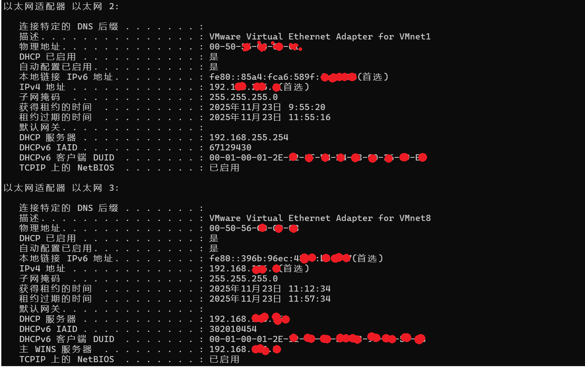

# VMware 虚拟网卡 VMnet1 / VMnet8 网络模式科普

在使用 VMware 虚拟机时，宿主机系统中会出现两个常见的虚拟网卡：

- **VMnet1** → Host-Only（仅主机）模式
- **VMnet8** → NAT（网络地址转换）模式

本文将解析它们在 Windows CMD 中的 `ipconfig /all` 输出，并科普相关网络原理。

---

## 1️⃣ 查看虚拟网卡信息

在 Windows 命令提示符（CMD）中，运行：

```bash
>>>ipconfig /all
```

你会看到类似输出：
以太网适配器 以太网 2:
   描述: VMware Virtual Ethernet Adapter for VMnet1
   物理地址: 00-50-56-C0-xx-xx
   DHCP 已启用: 是
   IPv4 地址: 192.168.xxx.x
   子网掩码: 255.255.255.0
   默认网关: （空）
   DHCP 服务器: 192.168.255.254

以太网适配器 以太网 3:
   描述: VMware Virtual Ethernet Adapter for VMnet8
   物理地址: 00-50-56-C0-xx-xx
   DHCP 已启用: 是
   IPv4 地址: 192.168.xxx.1
   子网掩码: 255.255.255.0
   默认网关: （空）
   DHCP 服务器: 192.168.126.xxx
   DNS 服务器: 192.168.xxx.x

## **以太网 2 (VMnet1)** —— Host-Only 模式

**信息逐项解析：**

-   **描述**：`VMware Virtual Ethernet Adapter for VMnet1`  
    → 表示这是 VMware 创建的虚拟网卡 VMnet1，用于 Host-Only（仅主机）模式网络。
-   **物理地址（MAC）**：`00-50-56-C0-xx-xx`  
    → VMware 虚拟网卡的 MAC，前缀 `00-50-56` 是 VMware OUI。
-   **DHCP 已启用**：是  
    → 自动从 VMware 内置的 DHCP 服务获取 IP（VMware Host-Only DHCP）。
-   **IPv4 地址**：`192.168.xxx.x`  
    → 这是宿主机在 Host-Only 网络中的 IP（相当于虚拟交换机的网关地址）。 → 虚拟机在 Host-Only模式下会获取同网段的地址（如 `192.168.255.x`）。
-   **子网掩码**：`255.255.255.0` → 掩码为 24 位（C类网络）。
-   **默认网关**：无（因为 Host-Only 不出网，只是在宿主机 ↔ 虚拟机网络）
-   **DHCP 服务器**：`192.168.255.xxx` → VMware 内置的 DHCP 服务地址。
-   **IPv6 地址**（本地链路）：`fe80::85a4:fca6:589f:xxxxxxx`

## **以太网 3 (VMnet8)** —— NAT 模式

**信息逐项解析：**

-   **描述**：`VMware Virtual Ethernet Adapter for VMnet8`  
    → VMware 创建的虚拟网卡 VMnet8，用于 NAT 模式。
-   **物理地址（MAC）**：`00-50-56-xx-xx-xx`
-   **DHCP 已启用**：是  
    → 从 VMware NAT DHCP 服务器自动获取 IP。
-   **IPv4 地址**：`192.168.xxx.x`  
    → 这是宿主机在 NAT 网络的 IP地址（相当于虚拟 NAT 设备的网关）。
-   **子网掩码**：`255.255.255.0`。
-   **默认网关**：无（因为这是宿主机的虚拟 NAT 网卡，它自己是网关）。
-   **DHCP 服务器**：`192.168.xxx.xxx` → VMware NAT DHCP 服务。
-   **DNS 服务器**：`192.168.xxx.x`（这个地址对应 VMware NAT设备，会转发到宿主机的真实 DNS）
-   **IPv6 地址**（本地链路）：`fe80::396b:96ec:483f:xxxxxx`
## 2️⃣ VMnet1 —— Host-Only 模式

Host-Only 网络的特点：

-   宿主机和虚拟机可以互相通信，形成一个 **隔离的局域网**。
-   虚拟机 **不能访问互联网**（除非额外配置路由转发）。
-   IP 地址通常在 `192.168.255.x` 网段，由 VMware 内置 DHCP 服务分配。
-   默认网关为空（不出网）。

  **数据流示意图：**
  虚拟机(192.168.255.x) ←→ 宿主机 VMnet1 (192.168.255.1)
（无外网通路）
## 3️⃣ VMnet8 —— NAT 模式

NAT 网络的特点：

-   虚拟机可通过 VMware 的 NAT 服务访问外网。
-   IP 地址通常在 `192.168.126.x` 网段，由 VMware 内置 DHCP 服务分配。
-   宿主机 VMnet8 的 IP 是虚拟网关（192.168.126.1）。
-   外网不能直接访问虚拟机，需要设置端口映射。

**数据流示意图：**
 虚拟机(192.168.126.x) ←→ 宿主机 VMnet8 (192.168.126.1) ←→ VMware NAT ←→ 外网
 ## 4️⃣ VMnet1 与 VMnet8 对比表

| 项目               | VMnet1 (Host-Only)         | VMnet8 (NAT)          |
|--------------------|----------------------------|-----------------------|
| 网络模式           | 仅主机模式（隔离局域网）   | NAT (网络地址转换)    |
| 宿主机IP           | 192.168.255.1              | 192.168.126.1         |
| 虚拟机能否上外网   | ❌                       | ✅                  |
| DHCP服务器         | 192.168.255.254            | 192.168.126.254       |
| 默认网关           | （空）                      | VMware NAT网关        |
| 应用场景           | 测试内网，隔离环境         | 虚拟机上网，开发测试  |
 
## 5️⃣**总结**：  
VMnet1 和 VMnet8 是 VMware 提供的两种虚拟网络连接方式，它们在宿主机 CMD 的 `ipconfig /all` 中会以不同的适配器名称和 IP 网段出现。理解它们的区别，有助于合理选择虚拟机网络配置，实现内网隔离或外网访问。
